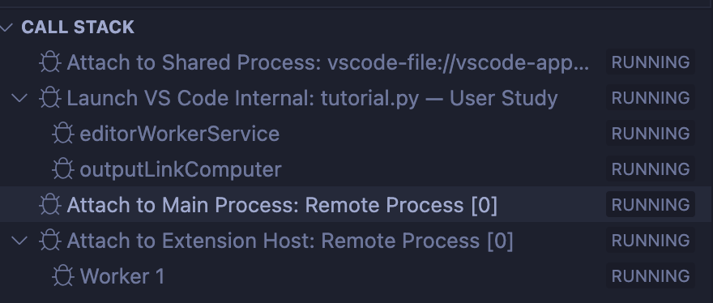

# Ivie: Lightweight Anchored Explanations of Just-Generated Code

This is the GitHub repo for our [CHI 2024 paper](https://arxiv.org/pdf/2403.02491)

## Table of Contents

1. [Prerequisites](#prerequisites)
2. [Getting Started](#getting-started)
3. [Installation](#installation)
4. [Configuration](#configuration)
5. [Build and Debug](#build-and-debug)
6. [Install GitHub Copilot in VSCode OSS Dev](#install-github-copilot-in-vscode-oss-dev)

## Prerequisites

Before you start, please ensure that you have the following software installed on your machine:

- [Git](https://git-scm.com/)
- [Node.js v16.18.1](https://nodejs.org/dist/v16.18.1/)
- [Yarn](https://yarnpkg.com/)

## Getting Started

To get started with the project, follow these steps:

1. Clone the repository to your local folder:

```
git clone https://github.com/YanLitao/Ivie.git
```

2. Install Node.js v16.18.1 from the [official website](https://nodejs.org/dist/v16.18.1/).

3. Install Yarn by running:

```
npm install -g yarn
```

## Installation

To install the project dependencies, follow these steps:

1. Change to the project directory:

```
cd <project-folder>
```

2. Install the dependencies:

```
yarn
```

3. Update the repository with the latest changes:

```
git pull
```


## Configuration

Set up your environment variables:

1. Add your `OPENAI_TOKEN` to your environment:

```
export OPENAI_TOKEN=your_openai_api_key_here
```

2. Verify that the environment variable is set correctly:

```
echo $OPENAI_TOKEN
```

## Build and Debug

To build and debug the project using Visual Studio Code, follow these steps:

1. Open the project folder in Visual Studio Code.

2. Press `Shift+Command+B` (sometimes you need to press twice) until you can find both `Core - Build` and `Ext - Build` on the right side of your Terminal inside Visual Studio Code.

3. Click on the debug icon on the left side bar, and then click on the Start Debugging icon on the top-left.

4. After opening Code - OSS (the testing editor), if you find the GitHub icon doesn't show up on the bottom-right corner, please turn back to the VScode interface and do the following steps:

- Click on the "Run and Debug" icon on the left sidebar.

- Find the "CALL STACK" widget.

- Find the session called "Launch VS Code Internal:..."

- Place your mouse over it, and when the tooltip shows up, click on the "restart" button.

- Wait until new sessions start (Please refer the image below). Then, return to Code - OSS.



The editor interface should appear now.

## Install GitHub Copilot in VSCode OSS Dev
Please install this version of [GitHub Copilot](https://www.vsixhub.com/vsix/63883/)
Make sure the version is 1.65.7705. Any older version or newer version may be incompatible with this version of VSCode OSS.
